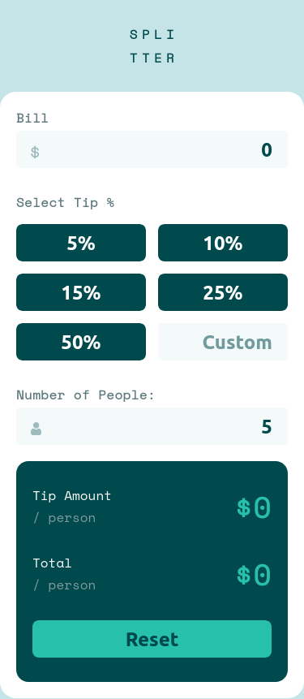
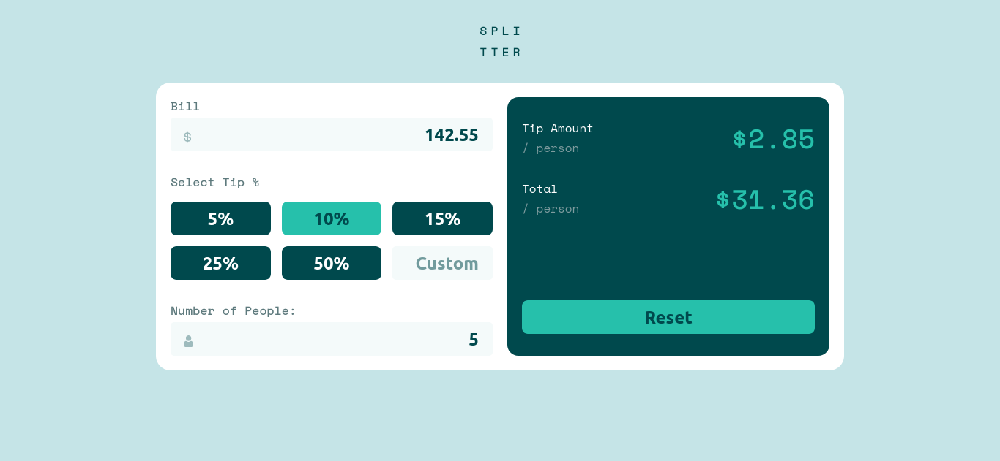

# Frontend Mentor - Tip calculator app solution

This is a solution to the [Tip calculator app challenge on Frontend Mentor](https://www.frontendmentor.io/challenges/tip-calculator-app-ugJNGbJUX). Frontend Mentor challenges help you improve your coding skills by building realistic projects.

## Table of contents

- [Overview](#overview)
  - [The challenge](#the-challenge)
  - [Screenshot](#screenshot)
  - [Links](#links)
- [My process](#my-process)
  - [Built with](#built-with)
- [Author](#author)

## Overview

### The challenge

Users should be able to:

- View the optimal layout for the app depending on their device's screen size
- See hover states for all interactive elements on the page
- Calculate the correct tip and total cost of the bill per person

### Screenshot

### Links

- Solution URL: [Github](https://github.com/lenard123/frontend-mentor/tree/master/2.%20Tip%20Calculator%20App)
- Live Site URL: [Github Page](https://lenard123.github.io/frontend-mentor/2.%20Tip%20Calculator%20App/)

## My process

### Built with

- Semantic HTML5 markup
- CSS custom properties
- Flexbox
- CSS Grid
- Mobile-first workflow

## Author

- Website - [Lenard Mangay-ayam](https://lenard123.github.io)
- Frontend Mentor - [@lenard123](https://www.frontendmentor.io/profile/lenard123)
- Twitter - [@_jlenard](https://www.twitter.com/_jlenard)